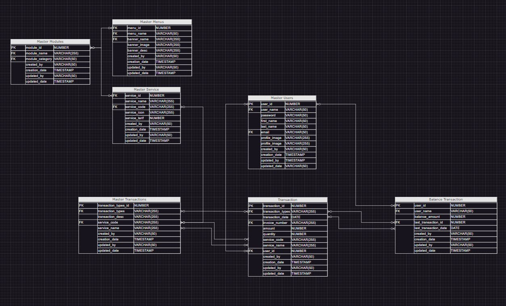

# Test Praktek API Programmer

Berikut untuk routing dari endpoint

Users
=======================================
/api/v1.0/registration.
/api/v1.0/login.
/api/v1.0/profile/image.
/api/v1.0/profile/update.
/api/v1.0/profile/image.

Modules
=======================================
/api/v1.0/banner.
/api/v1.0/service.

Transactions
=======================================
/api/v1.0/balance.
/api/v1.0/topup.
/api/v1.0/transaction/history?limit=3&offset=0.
/api/v1.0/transaction.

## Desgin Database

